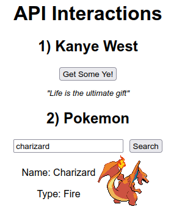

# API Interactions: Kanye West & Pokemon

This is a web app that fetches data from a couple different APIs. There is a section containing a button to fetch and output tweets from Kanye West. There is a also a section to search for different Pokemon to get their type and image in return. Data is randomly fetched and outputted upon loading the page and can of course be updated through user input.

## Technologies Used
* HTML
* CSS
* SCSS
* Vanilla JS
* React
* JSON